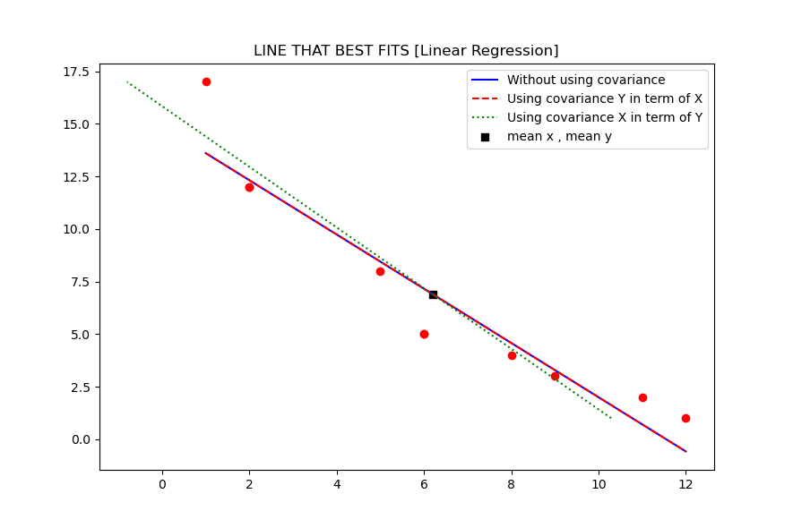

# Linear-regression
This code is intended to show the basic math behind linear regression analysis.
This repository contains code that demonstrates the implementation of linear regression using basic mathematical principles. Linear regression is a fundamental machine learning algorithm that aims to establish a linear relationship between a dependent variable and one or more independent variables.

In this project, we focus on the implementation of linear regression without relying on external libraries or complex mathematical frameworks. By using basic mathematical operations and concepts, we aim to provide a clear understanding of the underlying principles of linear regression.

